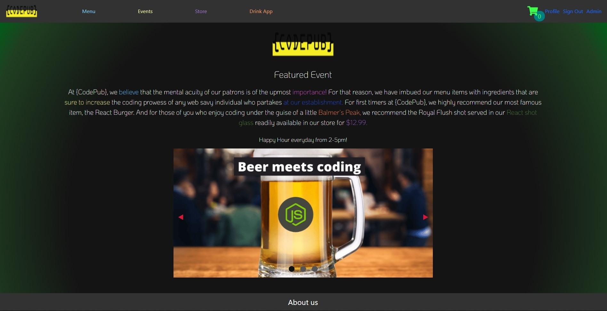

# {codePub}

## Table of Contents
  - [Table of Contents](#table-of-contents)
  - [Description](#description)
  - [UserStory](#User-Story)
  - [Usage](#usage)
  - [Contribution Guidelines](#contribution-guidelines)
  - [License Information](#license-information)
    - [No license](#no-license)
  - [Questions](#questions)

## Description

Deployed App: https://code-pub.herokuapp.com/

Code Pub is a mock site of a restaurant made with react.js and redux to manage the states. Code Pub features user login authentication with json web tokens and the ability to purchase goods from our merch store. The store currently uses sandbox mode for PayPal checkout. We post events that users can sign up for as see a list of their events on their profile page. Users can also use our fun drink app that features a random drink generator using The Cocktail API, as well as a drink roulette wheel. Checkout our menu as well. PayPal sandbox requires test info (Can't use your own credentials)

Technologies used:
- React.js
- Redux
- Redux-thunk
- Multer
- PayPal Sandbox
- Node.js
- JavaScript
- Sequelize ORM
- Jsonwebtokens npm
- Axios
- Framer-motion

## User Story

As a user, I want to view a website for my restaurant {codePub}, so that when I enter the home page, I am greeted with a brief description of our Pub as well as a navigation bar to help users explore the website.

As a user, I want to view a menu page so that when I enter, I see a list of pictures of menu items that can be flipped over to show a description of the item, as well as for the drink options when I click the drink options checkbox form.

As a user, I want to shop through the store page so that when I checkout using a paypal mock system, the order will show as processed after my info has been inputted.  

As a user, I want to use the drink application page so that when I click on the drink randomizer button, I am shown a random drink based on the liquor of my choice.

As a user, I want to use the drink application page so that when I click on the roulette wheel button, the wheel will spin and I will drink depending on if the category pertains to me or not.

<!-- profile and events user story -->

## Usage

## Contribution Guidelines
Nathan Peek, Raquel Diaz, Hader Cortez, David Sanchez, Fidel Bello

## License Information
### No license

## Questions
If you have further questions you can contact us at nmp14fsu@gmail.com, Rachel7113@gmail.com (insert others).

